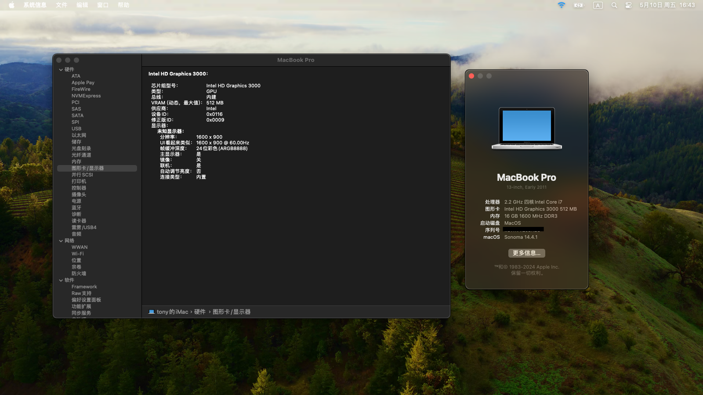

Lenovo T420 installs hackintosh 

_**2024.10.29**_: 
Updated OC 1.0.2 and some kexts. It may support sequoia, but my T420 is not around so I can't test it. 

_**2024.5.11**_: 
OC 1.0.0 and supports ventura and sonoma. Lower system versions have not been tested and may be supported. 

 

_**HARDWARE**_: 

&nbsp;&nbsp;&nbsp;&nbsp;CPU: i7 2670qm 
&nbsp;&nbsp;&nbsp;&nbsp;iGPU: HD3000 
&nbsp;&nbsp;&nbsp;&nbsp;Wireless: CF-WU810N (USB wireless card) 

 
STEP: 

1. First change the model to iMac19,1, then install the system. After the system installation is completed, change the model back to MacBookPro8,1 

2. Install kdk (https://github.com/dortania/KdkSupportPkg) 

3. Install patches using OCLP (https://github.com/dortania/OpenCore-Legacy-Patcher) 

4. [optional] USB wireless card driver (https://github.com/chris1111/Wireless-USB-OC-Big-Sur-Adapter) or (https://github.com/chris1111/Wireless-USB-Big-Sur-Adapter) 

 
 

_**Broadcom Wireless Card driver has been added, but has not been tested, may be supported**_ 

 
 

